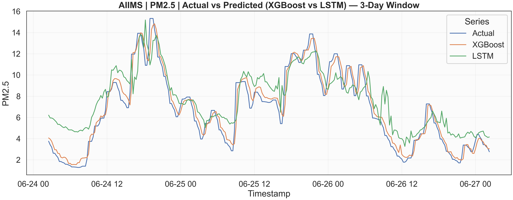
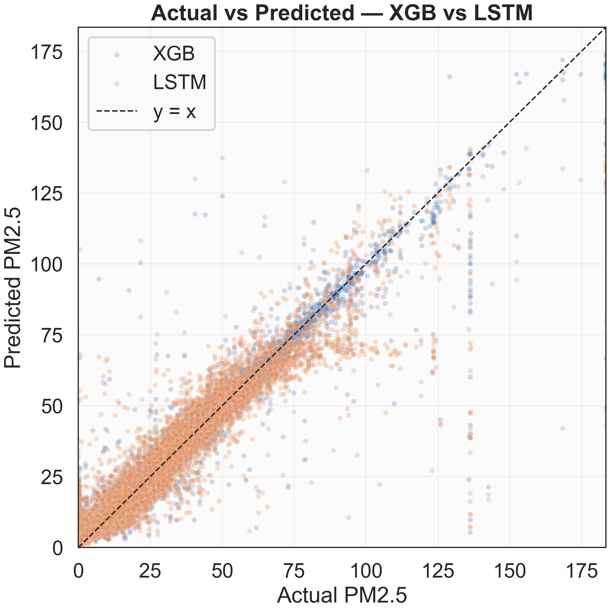
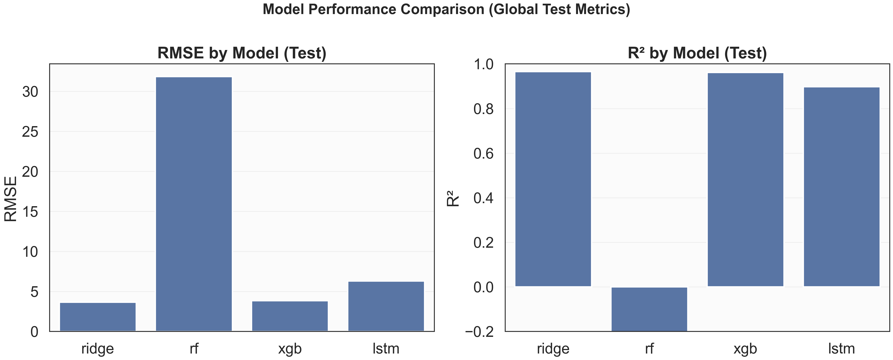

# Air Quality Prediction (PM2.5) - Final Submission

This repository predicts **PM2.5** from multi-station air-quality time series (15-minute data) using:
- Classical models: Ridge / Random Forest / XGBoost
- Deep learning baseline: LSTM (TensorFlow/Keras)
- Final strategy: **station-aware routing** (best model chosen per station on validation)

Large data (raw Excel + parquet splits + big model binaries) is intentionally not tracked in GitHub. The repo is readable on GitHub without running anything: metrics + plots are committed.

## What to open first (no running required)

- Final routed result (station-aware ensemble): `artifacts/classical_metrics_routed_v4.json`
- LSTM result + tensor-shape/scalers info: `artifacts/lstm_metrics.json`
- Unified comparison table (global + per-station): `artifacts/metrics.csv`
- Plots (dpi=300): `artifacts/plots/*.png`

## Results at a glance (Test)

### Routed classical ensemble (recommended final system)

Chosen per station (by **validation RMSE**):
- AIIMS -> XGBoost
- BHATAGAON -> Ridge
- IGKV -> Ridge
- SILTARA -> Ridge

Global test (from `artifacts/classical_metrics_routed_v4.json`):
- RMSE: **3.94**
- MAE: **1.43**
- R²: **0.9607**

### Unified comparison (global, aligned evaluation window)

The table in `artifacts/metrics.csv` evaluates all 4 models on the same aligned rows
(LSTM cannot predict the first `T=96` steps per station).

| Model | RMSE | MAE | R² |
|---|---:|---:|---:|
| ridge | 3.65 | 1.38 | 0.9657 |
| xgb | 3.84 | 1.48 | 0.9620 |
| lstm | 6.29 | 3.04 | 0.8978 |
| rf | 31.82 | 16.43 | -1.611 |

> Note: Random Forest is included for completeness, but it performs poorly here.

## Plots (report-ready)

Prediction vs Actual (3-day window, AIIMS, XGBoost vs LSTM):

Scatter comparison (XGBoost vs LSTM, with y=x):

Global bar chart comparison (RMSE and R²):

## Pipeline overview (scripts)

1. Phase A - ingestion: `1_ingest_excel.py`
2. Phase B - preprocessing + features: `2_preprocess_and_features.py`
   - Leakage-safe target capping (`--target-cap-quantile`)
   - Schema stabilization across splits (`--schema-stable`)
3. Phase C - classical models: `3_train_classical.py`
   - Optional per-station training (`--per-station`)
   - Optional XGB tuning sweep (`--xgb-tune`)
4. Routing (best model per station): `9_route_models_by_station.py`
5. Phase D - LSTM: `4_train_lstm.py`
6. Phase E/F - evaluation + plots: `5_evaluate_and_plot.py`

Exact commands used are in `PHASES_RUNBOOK.md`.

## Dependencies

- Ingestion: `requirements_ingest.txt`
- ML + plotting: `requirements_ml.txt`

## GitHub size policy

This repo ships with only:
- code + docs
- small metrics JSON/CSV
- PNG plots

If you must push large datasets/models, use Git LFS (not required for this submission).

