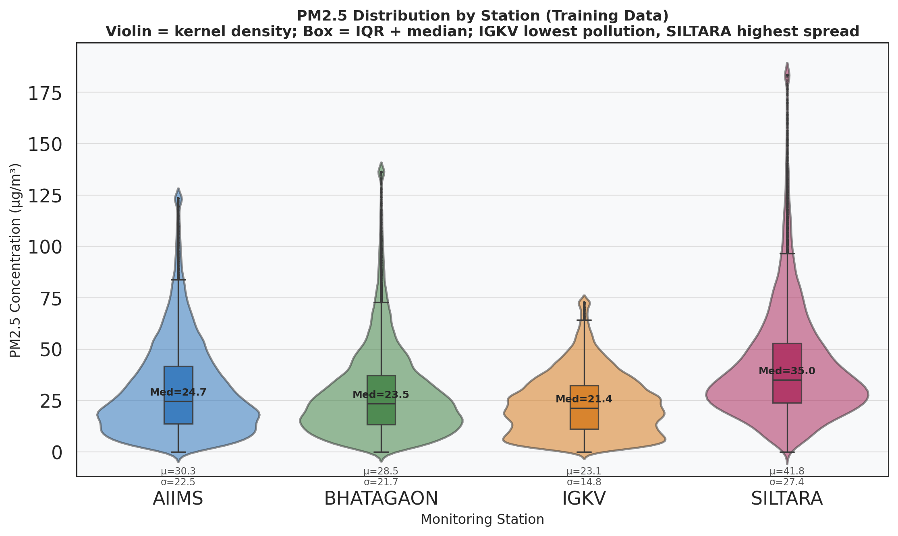
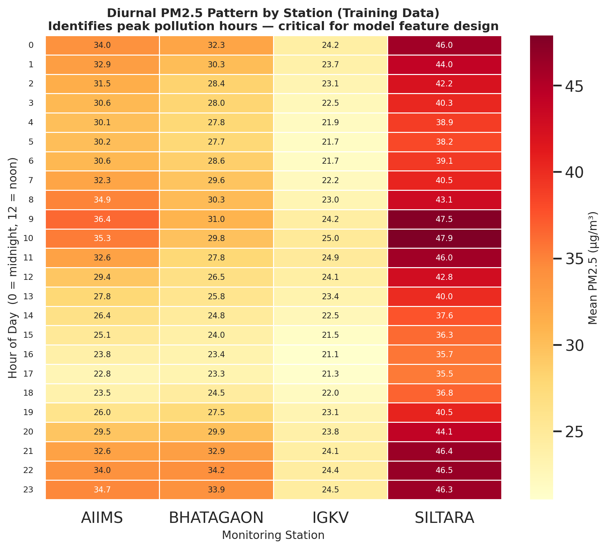
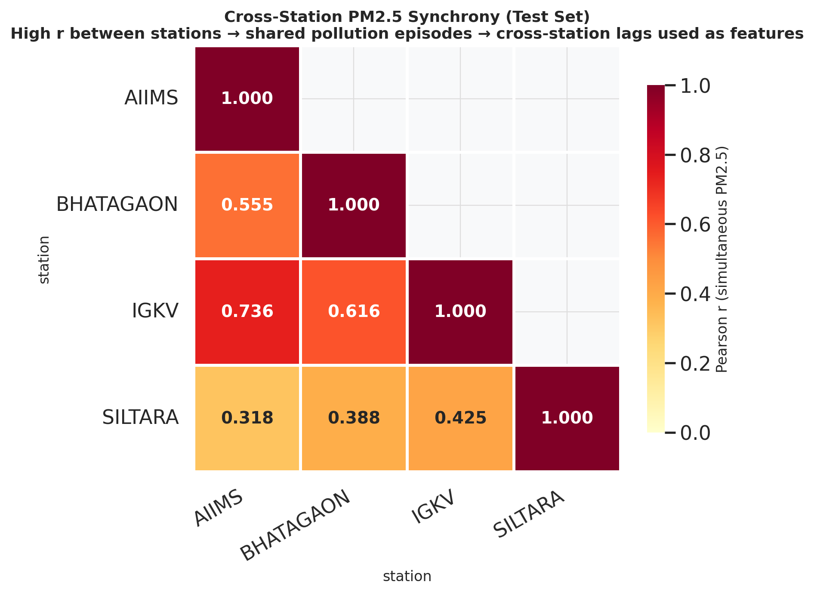
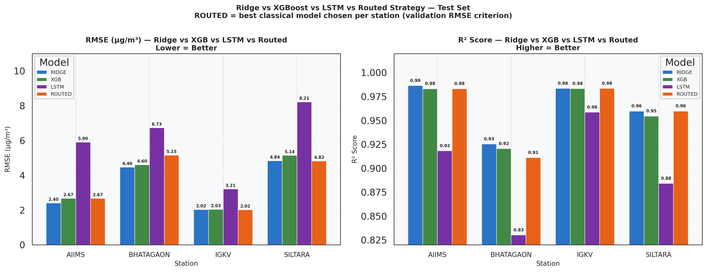
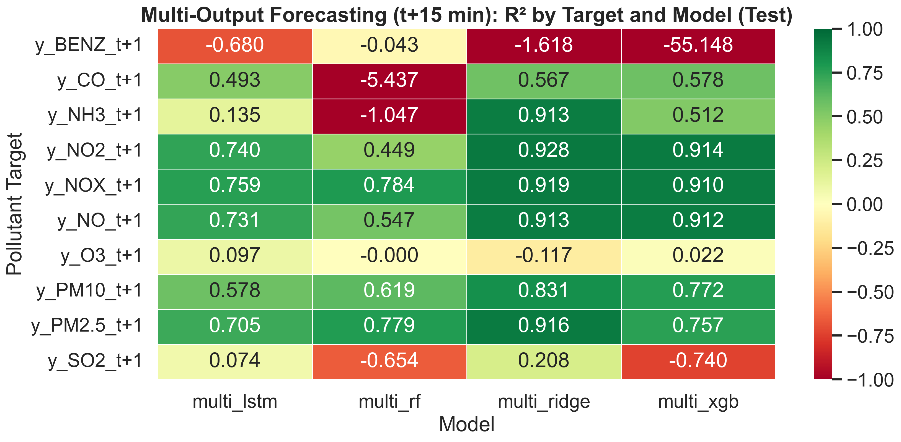
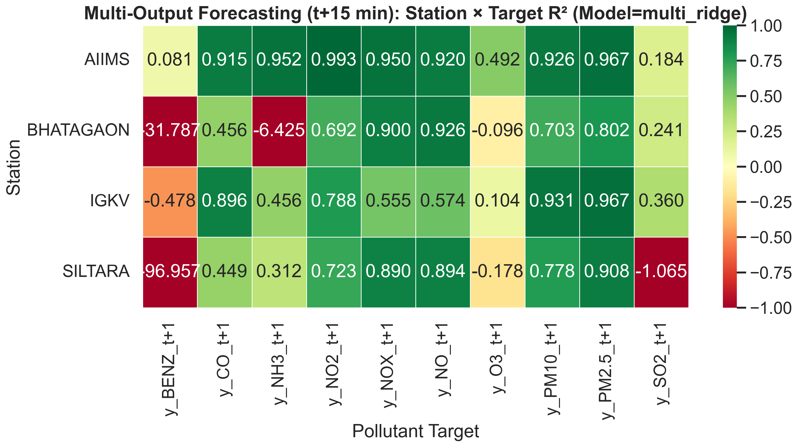

# Air Quality Prediction (PM2.5) — Multi-Station Analysis

Predicting **PM2.5** across four distinct air-quality monitoring stations (AIIMS, Bhatagaon, IGKV, Siltara) using high-frequency (15-minute) time-series data. This repository implements a full pipeline: from raw Excel ingestion to a "station-aware" routed machine learning ensemble.

---

## 📊 Core Dataset Insights

Before modeling, we analyzed the temporal and spatial characteristics of Raipur's air quality.

### 1. Pollution Distribution & The "Industrial Island"
Most urban stations (AIIMS, IGKV) show typical urban pollution patterns. However, **Siltara** is an industrial outlier with extreme spikes (reaching >500 µg/m³) and a significantly higher baseline.

### 2. Diurnal Rhythms (Industrial vs. Logistic)
Air quality follows a strict daily rhythm. 
*   **AIIMS/IGKV:** Peak during early morning and late night due to temperature inversion.
*   **Bhatagaon:** Shows strong logistic/transport influence (near a major bus terminal).

### 3. Cross-Station Synchrony
Are the stations moving in sync? 
*   **High Connection (0.74):** AIIMS and IGKV move together, sharing the city-wide atmosphere.
*   **Low Connection (0.32):** Siltara is "decoupled," meaning its pollution is driven by local industrial stacks rather than regional weather.

---

## 🧠 Modeling & Feature Engineering

### Feature Strategy
We don't just predict PM2.5 based on current weather. The air has **memory**.
*   **Lags (15min to 24hr):** Gives the model a memory of the immediate past.
*   **Rolling Means (1hr to 12hr):** Identifies the overall trend (rising vs. falling).
*   **Wind/Time Cyclic Features:** Converts degrees (WD) and Hours into Sin/Cos waves for mathematical stability.

### Results: The Final Scorecard
We evaluated Ridge, XGBoost, and LSTM models. The final system is a **Routed Ensemble**, choosing the best-validated model for each specific station's DNA.

**Global Performance (Test Set):**
| Metric | Value |
|---|---|
| **RMSE** | **3.94** |
| **MAE** | **1.43** |
| **R² Score** | **0.9607** |

---

## Multi-Pollutant Forecasting (t+15 min) — Class Feedback Extension

To avoid the “everyone predicted only PM2.5” issue, we also include a **single multi-output model** that forecasts multiple pollutants **15 minutes ahead** (station-safe; no cross-station leakage).

Outputs:
- `artifacts/multioutput_metrics.csv`
- `artifacts/plots/viva/07_multioutput/`

Key visuals:

---

## 🚀 How to Run the Pipeline

1.  **Ingestion:** `1_ingest_excel.py` — Merges disparate multi-sheet Excel files into a canonical parquet master.
2.  **Preprocessing:** `2_preprocess_and_features.py` — Handles missing data, applies "Time-Splitting," and generates the high-dimensional feature space (Lags/Rolls).
3.  **Classical Training:** `3_train_classical.py` — Trains optimized Ridge/XGBoost models per station.
4.  **Routing:** `9_route_models_by_station.py` — Selects the optimal model for each station based on local cross-validation.
5.  **Deep Learning:** `4_train_lstm.py` — Benchmarks against a 3-layer LSTM with persistent time-context.
6.  **Visualization:** `6_viva_plots.py` — Generates the publication-quality plots seen in this README.
7.  **Multi-Output Extension:** `3_train_multioutput.py` + `7_multioutput_plots.py` — Forecasts multiple pollutants (t+15 min).
8.  **Comparative Study:** `8_compare_global_vs_station.py` — Trains global models and compares against per-station/routed results.

---
**Repository Policy:** Large data binaries (`.parquet`, `.h5`, `.joblib`) are excluded via `.gitignore`. The `artifacts/` folder contains only the metrics and plot assets for transparent review.
